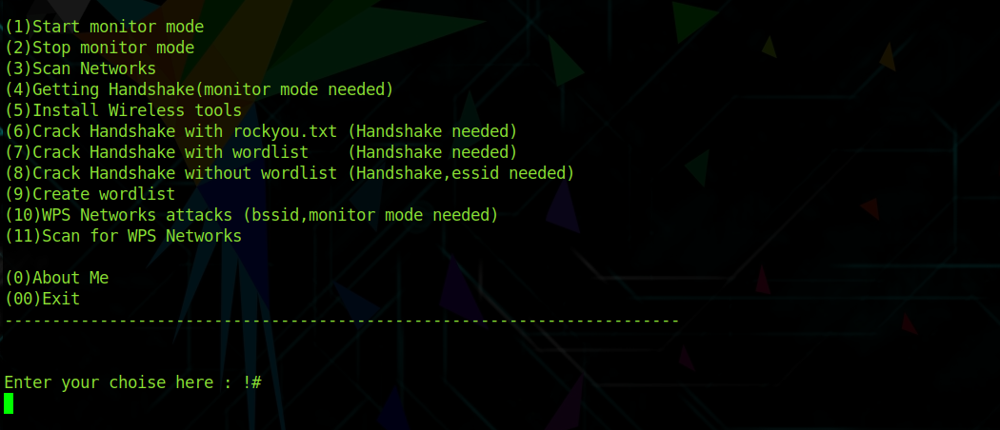
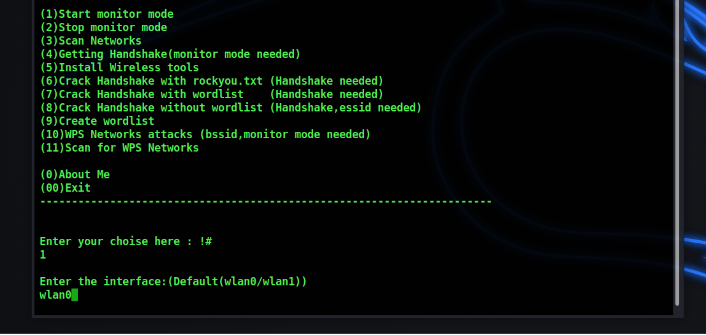
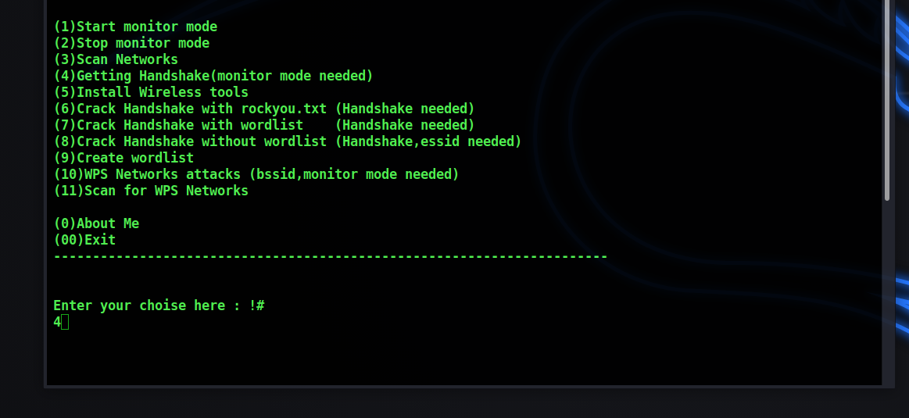
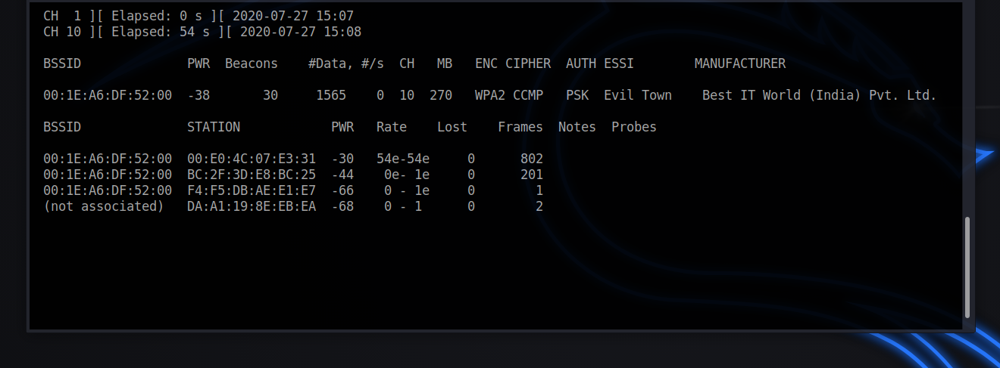
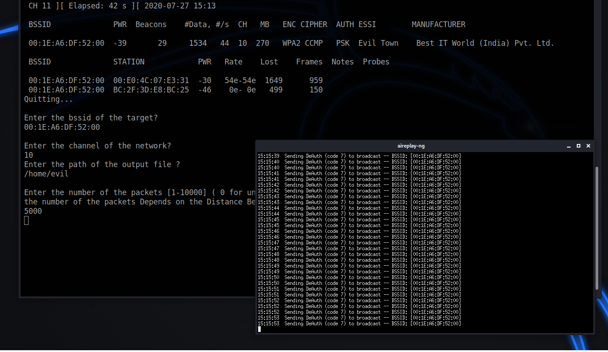
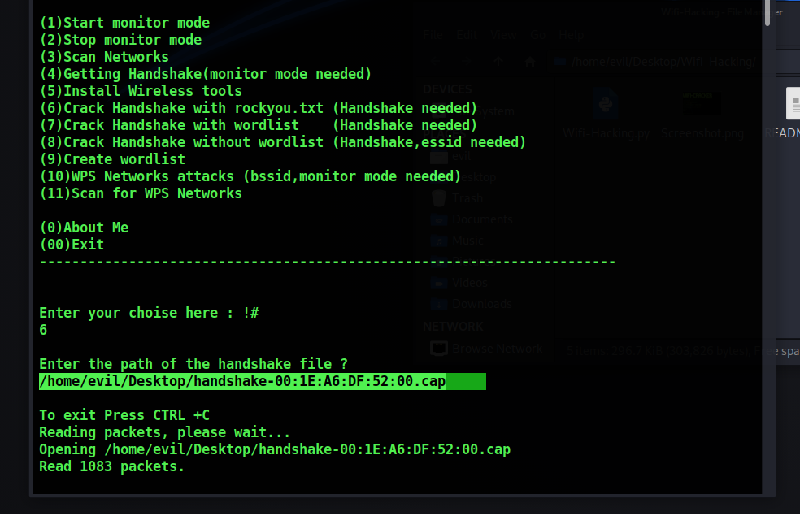
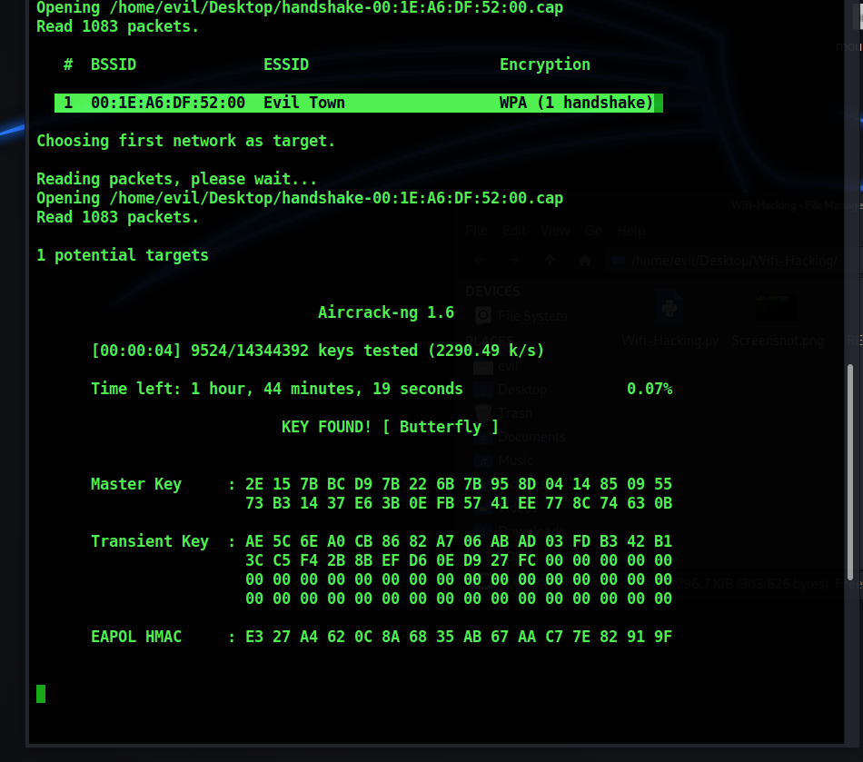
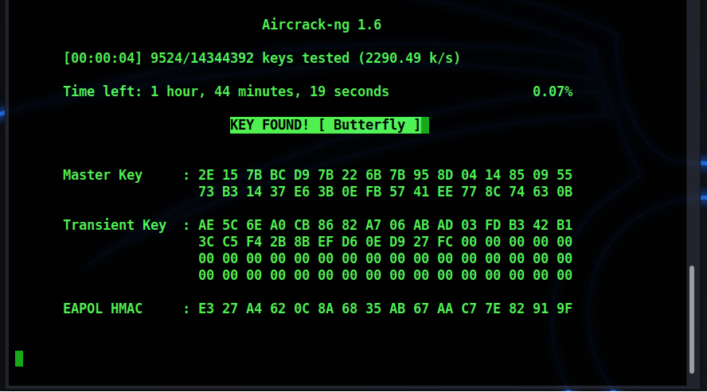

any error contact me +918604449216

https://instagram.com/swayampandit00/


full description are added after some time

## Feutures and Contains :


```bash 
1)Start monitor mode

2)Stop monitor mode

3)Scan Networks   

4)Getting Handshake

5)Create wordlist

6)Install Wireless tools                  

7)WPS Networks attacks 

8)Scan for WPS Networks

9)Crack Handshake with rockyou.txt

10)Crack Handshake with wordlist

11)Crack Handshake without wordlist
```

## Tested On :

* Kali Linux
* BlackArch Linux
* Ubuntu
* Kali Nethunter
* Termux ( Rooted Devices)
* Parrot OS


# Installation


### Kali Linux / Ubuntu / Parrot OS

```bash
1) sudo apt-get update && apt-get install git
2) sudo git clone https://github.com/swayampandit00/wi-fi-hack/
3) cd wi-fi-hack/
4) sudo python3 wi-fihack.py
```

## Creator

(swayam upadhyay) Hey, Dont Forget To say Thanks me :smile:

# SCREENSHOT











